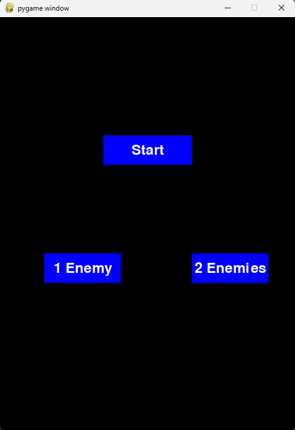
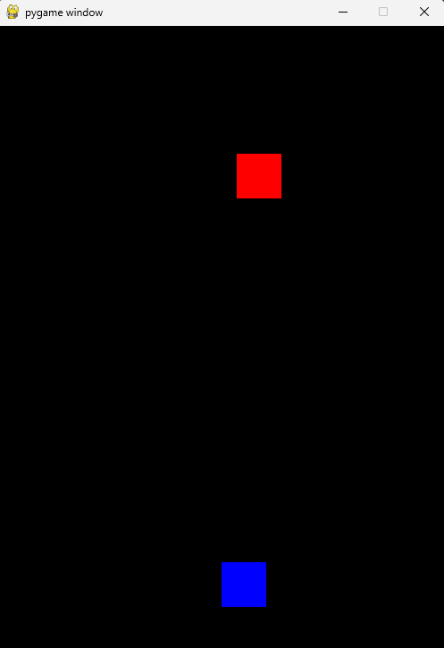
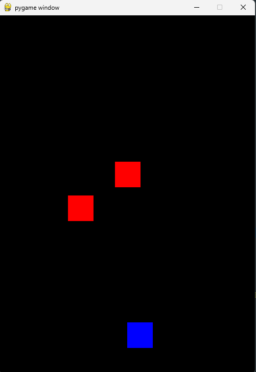

# PyGame

---

First project using PyGame

# Enemy dodging game

## Table of Contents

1. [Starting Screen](#starting-screen)
2. [Game](#game)

### Starting screen

---

On this first screen the player has the opportunity to select an option, whether they want to play with one enemy or with two enemies. After selecting the option, you will need to press START to start the game

Reference image

### Game

---

The game consists of moving the right and left arrows on the keyboard to move the player (Blue Color), in order to avoid the enemies (Red Color).

Reference image with 1 enemy

Reference image with 2 enemies
